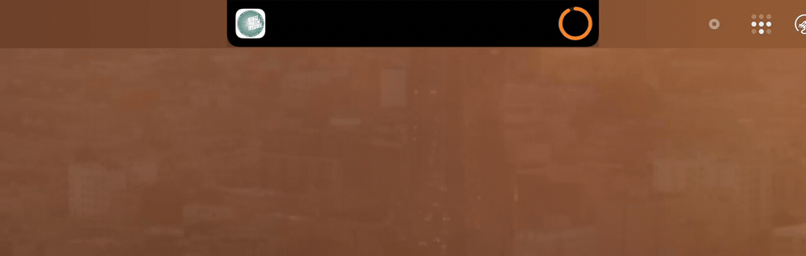

<div align="center">

# Dynamic Island for macOS

### The iPhone's Dynamic Island — reborn around your MacBook's notch.

Live music, an interactive **dotted-waveform scrubber**, and your **real-time Claude usage** — all wrapped around the notch, expanding on hover. No dock icon. No menu-bar clutter. Just the notch, doing more.

<br />



<br />


</div>

---

## ✦ What it does

Your notch becomes a living control center. **Collapsed**, it hugs the notch with album art on the left and a Claude usage ring on the right. **Hover**, and it expands with a fluid spring animation into a full panel.

<table>
<tr>
<td width="50%" valign="top">

### 🎧 Now Playing
- **Album art / video thumbnail** of the current Spotify track — or the active YouTube tab in Chrome as a fallback.
- **Transport controls** — previous · play/pause · next.
- **Dotted-waveform scrubber** — a sound-wave–styled progress bar made of dots. Drag or tap anywhere to **seek**.
- **Source badge** — a Spotify / YouTube glyph plus artist, so you always know what's playing and where.
- **Tap the art, title, or badge** to jump straight into Spotify on the current song.

</td>
<td width="50%" valign="top">

### 📊 Claude Usage
- **Live ring** showing your **real** rolling 5-hour session limit, straight from Anthropic.
- **Hover** for the weekly (7-day) limit, the Opus weekly limit (Max plans), and exact reset times.
- **Stats view** — lifetime tokens, total API value, monthly value vs. plan price, and a 14-day history sparkline.
- Reads the OAuth token Claude Code already manages — **no separate login.**

</td>
</tr>
</table>

---

## ✦ The waveform scrubber

The progress bar isn't a line — it's a **dotted sound wave**. Each column is a vertical stack of dots whose height follows a stable, organic amplitude, so it reads like a real waveform without flickering on redraw. Played columns glow bright; the rest stay dim.

- **Drag or tap** to seek anywhere in the track.
- **Buttery-smooth motion** — the player position is polled every ~1.5 s, but the fill extrapolates locally via a `TimelineView`, so it glides instead of stepping.
- Live **elapsed / total** timestamps, Spotify-style.

---

## ✦ Install

```bash
./install.sh
```

This builds the app, installs it to `~/Applications/DynamicIsland.app`, and registers a LaunchAgent (`~/Library/LaunchAgents/com.julian.dynamicisland.plist`) with `RunAtLoad` + `KeepAlive` — so it starts at login and relaunches itself if it ever crashes.

> The app runs as a background agent (`LSUIElement`): **no dock icon, no menu-bar icon.** It just lives on the notch.

### Update

```bash
./install.sh   # rebuilds and hot-swaps the running instance
```

### Uninstall

```bash
launchctl bootout "gui/$(id -u)/com.julian.dynamicisland"   # stop + disable autostart
rm -f ~/Library/LaunchAgents/com.julian.dynamicisland.plist
rm -rf ~/Applications/DynamicIsland.app
```

---

## ✦ Real Claude data

The ring shows the **actual** 5-hour session utilization pulled live from Anthropic's OAuth usage endpoint (`/api/oauth/usage`) — the same number you see in Claude's settings or via `/usage` in Claude Code.

- The OAuth token is read from the Keychain entry Claude Code maintains (`Claude Code-credentials`) — no extra sign-in.
- Polled only every 5 minutes; the endpoint rate-limits aggressively (HTTP 429 otherwise).
- Token refreshes from Claude Code are picked up automatically — the token is re-read on every fetch.

---

## ✦ Architecture

Pure SwiftUI + AppKit, **zero third-party dependencies**, built straight from source with `swiftc`.

| File | Responsibility |
| --- | --- |
| `Sources/IslandView.swift` | The SwiftUI island — collapsed/expanded layouts, the dotted-waveform scrubber, source glyphs, spring animations. |
| `Sources/SpotifyMonitor.swift` | Polls Spotify / Chrome via AppleScript, downloads artwork, handles play/pause/seek/reveal. |
| `Sources/ClaudeUsageMonitor.swift` | Fetches the live 5h / weekly / Opus usage from Anthropic. |
| `Sources/ClaudeStatsMonitor.swift` | Aggregates lifetime tokens, cost, and the 14-day history from local JSONL logs. |
| `Sources/NotchWindow.swift` | Borderless, click-through floating panel positioned around the notch + hover logic. |
| `Sources/AppDelegate.swift` · `main.swift` | Background agent app, single-instance, repositions on display changes. |

---

## ✦ Requirements

- macOS 13+ on a **notched MacBook** (it auto-detects the notch geometry).
- **Spotify** for full playback controls; **Google Chrome** for the YouTube fallback.
- On first launch, macOS will ask to allow **Automation** (controlling Spotify / Chrome) — approve it for controls and tap-to-reveal to work.

<div align="center">
<br />
<sub>Built with SwiftUI for the notch that finally earns its keep.</sub>
</div>
